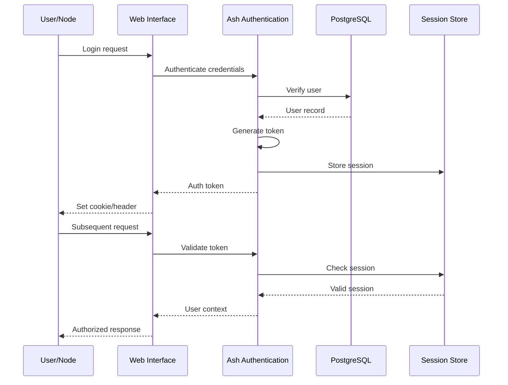

# Backend Architecture

## Service Architecture

### Controller/Route Organization
```
apps/xpando_core/lib/xpando/
├── core/                      # Ash Resources (domain models)
│   ├── resources/
│   │   ├── node.ex           # Node resource
│   │   ├── knowledge.ex      # Knowledge resource
│   │   └── contribution.ex   # Contribution resource
│   └── registry.ex           # Ash Registry
├── mother_core/              # Mother Core implementation
│   ├── consensus.ex         # Consensus engine
│   ├── knowledge_merger.ex  # Merge strategies
│   └── supervisor.ex        # OTP supervisor
├── p2p/                      # P2P networking
│   ├── node_manager.ex      # Node lifecycle
│   ├── discovery.ex         # libcluster integration
│   └── protocol.ex          # P2P protocol
├── ai/                       # AI provider integration
│   ├── broadway/
│   │   ├── pipeline.ex      # Broadway pipeline
│   │   └── producer.ex      # Message producer
│   └── adapters/
│       ├── openai.ex        # OpenAI adapter
│       ├── anthropic.ex     # Anthropic adapter
│       └── google.ex        # Google adapter
└── blockchain/               # Solana integration
    ├── xpd_token.ex         # Token operations
    └── wallet.ex            # Wallet management
```

### Ash Resource Template
```elixir
defmodule XPando.Core.Node do
  use Ash.Resource,
    domain: XPando.Core,
    data_layer: AshPostgres.DataLayer,
    authorizers: [Ash.Policy.Authorizer]
  
  postgres do
    table "nodes"
    repo XPando.Repo
  end
  
  attributes do
    uuid_primary_key :id
    
    attribute :name, :string, allow_nil?: false
    attribute :status, :atom do
      constraints one_of: [:online, :offline, :syncing]
      default :offline
    end
    attribute :specializations, {:array, :string}, default: []
    attribute :reputation_score, :decimal, default: Decimal.new(0)
    attribute :wallet_address, :string
    attribute :last_heartbeat, :utc_datetime_usec
    
    timestamps()
  end
  
  relationships do
    has_many :contributions, XPando.Core.Contribution
    has_many :knowledge, XPando.Core.Knowledge
  end
  
  actions do
    defaults [:read]
    
    create :register do
      accept [:name, :specializations, :wallet_address]
      
      change fn changeset, _ ->
        Ash.Changeset.after_action(changeset, fn _changeset, node ->
          # Announce to P2P network
          XPando.P2P.NodeManager.announce_node(node)
          {:ok, node}
        end)
      end
    end
    
    update :heartbeat do
      change set_attribute(:last_heartbeat, DateTime.utc_now())
      change set_attribute(:status, :online)
    end
  end
  
  calculations do
    calculate :knowledge_count, :integer do
      calculation fn records, _opts ->
        Enum.map(records, fn record ->
          XPando.Core.Knowledge
          |> Ash.Query.filter(created_by_id == ^record.id)
          |> Ash.count!()
        end)
      end
    end
  end
  
  policies do
    policy action_type(:read) do
      authorize_if always()
    end
    
    policy action_type(:create) do
      authorize_if actor_attribute_equals(:role, :admin)
      authorize_if action(:register)
    end
  end
end
```

## Database Architecture

### Schema Design (Managed by Ash Migrations)
```sql
-- Generated by Ash/AshPostgres migrations
-- Core domain tables with Ash-managed columns

CREATE EXTENSION IF NOT EXISTS "uuid-ossp";
CREATE EXTENSION IF NOT EXISTS "pgcrypto";

-- Nodes with full-text search on specializations
CREATE TABLE nodes (
    id UUID PRIMARY KEY DEFAULT uuid_generate_v4(),
    name TEXT NOT NULL,
    status TEXT NOT NULL CHECK (status IN ('online', 'offline', 'syncing')),
    specializations TEXT[] DEFAULT ARRAY[]::TEXT[],
    reputation_score NUMERIC(5,2) DEFAULT 0.00,
    wallet_address TEXT,
    last_heartbeat TIMESTAMPTZ,
    metadata JSONB DEFAULT '{}'::JSONB,
    inserted_at TIMESTAMPTZ NOT NULL DEFAULT CURRENT_TIMESTAMP,
    updated_at TIMESTAMPTZ NOT NULL DEFAULT CURRENT_TIMESTAMP
);

-- Indexes for performance
CREATE INDEX idx_nodes_specializations_gin ON nodes USING GIN(specializations);
CREATE INDEX idx_nodes_reputation_desc ON nodes(reputation_score DESC);
CREATE INDEX idx_nodes_status_heartbeat ON nodes(status, last_heartbeat);

-- Trigger for updated_at
CREATE TRIGGER update_nodes_updated_at 
    BEFORE UPDATE ON nodes 
    FOR EACH ROW 
    EXECUTE FUNCTION update_updated_at_column();
```

### Data Access Layer (Repository Pattern via Ash)
```elixir
defmodule XPando.Core do
  use Ash.Domain
  
  resources do
    resource XPando.Core.Node
    resource XPando.Core.Knowledge
    resource XPando.Core.Contribution
  end
  
  # Domain-level functions
  def get_online_nodes do
    Node
    |> Ash.Query.filter(status == :online)
    |> Ash.Query.sort(reputation_score: :desc)
    |> Ash.read!()
  end
  
  def submit_knowledge(node_id, knowledge_params) do
    Knowledge
    |> Ash.Changeset.for_create(:submit, Map.put(knowledge_params, :created_by_id, node_id))
    |> Ash.create()
  end
  
  def validate_knowledge(knowledge_id, validator_node_id, validation_params) do
    # Transaction for atomic validation
    Ash.bulk_create([
      {XPando.Core.Validation, :create, validation_params}
    ])
  end
end
```

## Authentication and Authorization

### Auth Flow


### Middleware/Guards (Ash Policies)
```elixir
defmodule XPando.Core.Knowledge do
  use Ash.Resource,
    authorizers: [Ash.Policy.Authorizer]
  
  policies do
    # Anyone can read knowledge
    policy action_type(:read) do
      authorize_if always()
    end
    
    # Only nodes can submit knowledge
    policy action_type(:create) do
      authorize_if relates_to_actor_via(:created_by)
    end
    
    # Only validated nodes can validate
    policy action(:validate) do
      authorize_if expr(actor.reputation_score >= 0.5)
    end
    
    # Admin override
    bypass always() do
      authorize_if actor_attribute_equals(:role, :admin)
    end
  end
end

# Phoenix plug for authentication
defmodule XPandoWeb.Plugs.RequireAuth do
  import Plug.Conn
  import Phoenix.Controller
  
  def init(opts), do: opts
  
  def call(conn, _opts) do
    case Ash.PlugHelpers.get_actor(conn) do
      nil ->
        conn
        |> put_status(:unauthorized)
        |> json(%{error: "Authentication required"})
        |> halt()
      
      _actor ->
        conn
    end
  end
end
```