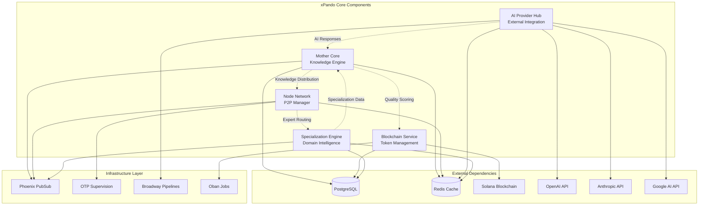

# Components

Based on the architectural patterns, tech stack, and data models defined above, xPando's component architecture follows a **distributed actor model** with clear boundaries and interfaces. Each component leverages Elixir/OTP's supervision trees for fault tolerance while maintaining loose coupling through well-defined APIs.

## Mother Core (Distributed Knowledge Engine)

**Responsibility:** Centralized knowledge aggregation, consensus validation, and intelligent distribution across the P2P network. Acts as the "brain" of the collective intelligence system.

**Key Interfaces:**
- `XPando.MotherCore.ingest_knowledge/2` - Accept knowledge contributions from nodes
- `XPando.MotherCore.validate_consensus/1` - Trigger Byzantine fault-tolerant validation
- `XPando.MotherCore.distribute_knowledge/1` - Propagate validated knowledge to network
- `XPando.MotherCore.query_knowledge/2` - Intelligent knowledge retrieval with confidence scoring

**Dependencies:** PostgreSQL via ash_postgres, ash_ai for AI integrations, Redis caching, Phoenix PubSub for distribution

**Technology Stack:** GenServer supervision tree, Ash Resources for persistence, ash_ai for MCP servers, Broadway pipelines for async processing

```elixir
defmodule XPando.MotherCore do
  use GenServer
  
  # Public API
  def ingest_knowledge(contribution, metadata) do
    GenServer.call(__MODULE__, {:ingest, contribution, metadata})
  end
  
  def validate_consensus(knowledge_id) do
    GenServer.cast(__MODULE__, {:validate, knowledge_id})
  end
  
  # GenServer callbacks with consensus logic
  def handle_call({:ingest, contribution, metadata}, _from, state) do
    case process_contribution(contribution, metadata) do
      {:ok, knowledge} -> 
        schedule_validation(knowledge.id)
        {:reply, {:ok, knowledge}, state}
      {:error, reason} -> 
        {:reply, {:error, reason}, state}
    end
  end
  
  defp process_contribution(contribution, metadata) do
    XPando.Core.Knowledge
    |> Ash.Changeset.for_create(:create_from_contribution, %{
      content: contribution.content,
      source_node: contribution.node_id,
      metadata: metadata
    })
    |> Ash.create()
  end
end
```

## Node Network Manager (P2P Coordination)

**Responsibility:** Manages P2P node discovery, connection health, network topology, and real-time communication between distributed AI nodes.

**Key Interfaces:**
- `XPando.NodeNetwork.discover_nodes/1` - libcluster-based node discovery
- `XPando.NodeNetwork.broadcast_status/2` - Node status updates across network
- `XPando.NodeNetwork.route_to_expert/2` - Intelligent routing to specialized nodes
- `XPando.NodeNetwork.monitor_connections/0` - Connection health and failover

**Dependencies:** libcluster, Phoenix Channels, BEAM distribution, Redis for topology caching

**Technology Stack:** GenServer cluster management, Phoenix PubSub, OTP distribution protocols

```elixir
defmodule XPando.NodeNetwork.Manager do
  use GenServer
  
  def start_link(opts) do
    GenServer.start_link(__MODULE__, opts, name: __MODULE__)
  end
  
  def discover_nodes(specialization \\ nil) do
    GenServer.call(__MODULE__, {:discover, specialization})
  end
  
  def broadcast_status(node_id, status) do
    GenServer.cast(__MODULE__, {:broadcast_status, node_id, status})
  end
  
  def handle_call({:discover, specialization}, _from, state) do
    nodes = Node.get_connected_nodes()
    |> filter_by_specialization(specialization)
    |> Enum.map(&load_node_metadata/1)
    
    {:reply, {:ok, nodes}, state}
  end
  
  def handle_cast({:broadcast_status, node_id, status}, state) do
    Phoenix.PubSub.broadcast(
      XPando.PubSub,
      "node_network:status",
      {:node_status_update, node_id, status, DateTime.utc_now()}
    )
    {:noreply, state}
  end
end
```

## AI Provider Integration Hub (External AI Coordination)

**Responsibility:** Manages connections to external AI providers (OpenAI, Anthropic, Google), implements circuit breaker patterns, and provides unified interface for AI capabilities.

**Key Interfaces:**
- `XPando.AI.query/3` - Unified AI query with provider selection
- `XPando.AI.stream_response/2` - Streaming responses for real-time interaction
- `XPando.AI.health_check/1` - Provider availability and performance monitoring
- `XPando.AI.estimate_cost/2` - Token usage and cost prediction

**Dependencies:** Broadway pipelines, HTTP clients (Req/Finch), Redis for response caching

**Technology Stack:** Broadway producers/consumers, GenServer for circuit breakers, ETS for hot caching

```elixir
defmodule XPando.AI.ProviderHub do
  use Broadway
  
  alias XPando.AI.Providers.{OpenAI, Anthropic, Google}
  
  def start_link(opts) do
    Broadway.start_link(__MODULE__,
      name: __MODULE__,
      producer: [
        module: {XPando.AI.Producer, []},
        concurrency: 10
      ],
      processors: [
        default: [
          concurrency: 50,
          max_demand: 20
        ]
      ]
    )
  end
  
  def query(prompt, options \\ []) do
    provider = select_optimal_provider(prompt, options)
    
    %{
      provider: provider,
      prompt: prompt,
      options: options,
      request_id: Ecto.UUID.generate()
    }
    |> Broadway.test_message()
    |> handle_message("default", %{})
  end
  
  def handle_message(_processor, message, _context) do
    %{data: %{provider: provider, prompt: prompt}} = message
    
    case apply(provider, :query, [prompt, message.data.options]) do
      {:ok, response} -> 
        cache_response(message.data.request_id, response)
        Message.ack(message)
      {:error, reason} ->
        Message.fail(message, reason)
    end
  end
end
```

## Blockchain Integration Service (XPD Token Management)

**Responsibility:** Handles Solana blockchain interactions, XPD token operations, wallet connectivity, and token distribution based on contribution quality.

**Key Interfaces:**
- `XPando.Blockchain.create_token/1` - SPL token creation and management
- `XPando.Blockchain.distribute_rewards/2` - Token distribution to contributors
- `XPando.Blockchain.verify_wallet/1` - Wallet authentication and validation
- `XPando.Blockchain.track_transactions/1` - Transaction monitoring and confirmation

**Dependencies:** Solana RPC endpoints, wallet adapters, Oban for async blockchain operations

**Technology Stack:** GenServer for wallet management, Oban jobs for blockchain ops, HTTP clients for Solana RPC

```elixir
defmodule XPando.Blockchain.TokenManager do
  use GenServer
  
  def start_link(opts) do
    GenServer.start_link(__MODULE__, opts, name: __MODULE__)
  end
  
  def distribute_rewards(contributions, total_pool) do
    GenServer.cast(__MODULE__, {:distribute_rewards, contributions, total_pool})
  end
  
  def verify_wallet(wallet_address) do
    GenServer.call(__MODULE__, {:verify_wallet, wallet_address})
  end
  
  def handle_cast({:distribute_rewards, contributions, total_pool}, state) do
    # Calculate token distribution based on contribution quality
    distributions = calculate_token_distribution(contributions, total_pool)
    
    # Queue blockchain transactions via Oban
    Enum.each(distributions, fn {wallet, amount} ->
      %{wallet_address: wallet, token_amount: amount, transaction_type: "reward"}
      |> XPando.Blockchain.TransactionWorker.new()
      |> Oban.insert()
    end)
    
    {:noreply, state}
  end
  
  def handle_call({:verify_wallet, wallet_address}, _from, state) do
    case Solana.RPC.get_account_info(wallet_address) do
      {:ok, account_info} -> {:reply, {:ok, account_info}, state}
      {:error, reason} -> {:reply, {:error, reason}, state}
    end
  end
end
```

## Expert Specialization Engine (Domain Intelligence)

**Responsibility:** Manages node specialization development, tracks expertise domains, routes queries to appropriate specialists, and maintains specialization scoring.

**Key Interfaces:**
- `XPando.Specialization.develop_expertise/2` - Node specialization training
- `XPando.Specialization.route_query/1` - Expert node selection for queries
- `XPando.Specialization.evaluate_performance/2` - Specialization performance tracking
- `XPando.Specialization.suggest_domains/1` - Recommend specialization areas

**Dependencies:** Ash Resources for specialization data, machine learning algorithms, Phoenix PubSub

**Technology Stack:** GenServer for specialization tracking, Nx/Axon for ML algorithms, ETS for performance caching

```elixir
defmodule XPando.Specialization.Engine do
  use GenServer
  
  def develop_expertise(node_id, domain, training_data) do
    GenServer.call(__MODULE__, {:develop_expertise, node_id, domain, training_data})
  end
  
  def route_query(query) do
    GenServer.call(__MODULE__, {:route_query, query})
  end
  
  def handle_call({:route_query, query}, _from, state) do
    domain = classify_query_domain(query)
    expert_nodes = find_domain_experts(domain)
    
    selected_node = expert_nodes
    |> Enum.sort_by(&get_expertise_score(&1, domain), :desc)
    |> Enum.filter(&node_available?/1)
    |> List.first()
    
    {:reply, {:ok, selected_node}, state}
  end
  
  defp classify_query_domain(query) do
    # ML-based domain classification
    query
    |> XPando.ML.DomainClassifier.classify()
    |> extract_primary_domain()
  end
end
```

## Component Diagrams


