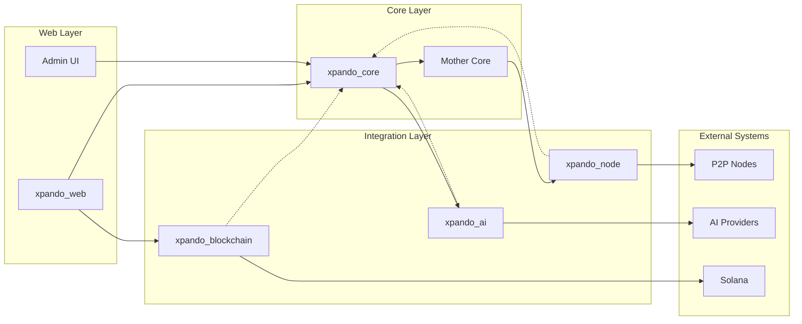

# Components

## xpando_web (Phoenix Web Application)

**Responsibility:** Web interface, real-time dashboards, and API endpoints for node management and monitoring

**Key Interfaces:**
- Phoenix LiveView routes for UI
- GraphQL API via Absinthe
- Phoenix Channels for WebSocket connections
- Admin dashboard via ash_admin

**Dependencies:** xpando_core, xpando_blockchain, Phoenix, Absinthe

**Technology Stack:** Phoenix 1.7, LiveView, DaisyUI, Tailwind CSS

## xpando_core (Core Domain Logic)

**Responsibility:** Implements all business logic, domain models, and knowledge management using Ash Framework

**Key Interfaces:**
- Ash Resources for all domain entities
- Ash Actions for business operations
- Ash Policies for authorization
- Ash Calculations for derived data

**Dependencies:** ash, ash_postgres, ash_authentication

**Technology Stack:** Ash 3.x, PostgreSQL adapters, ETS caching

## xpando_node (P2P Node Runtime)

**Responsibility:** Manages individual AI node lifecycle, P2P communication, and knowledge sharing protocols

**Key Interfaces:**
- GenServer-based node processes
- libcluster integration for discovery
- Phoenix PubSub for messaging
- Knowledge sync protocols

**Dependencies:** xpando_core, libcluster, Phoenix.PubSub

**Technology Stack:** OTP GenServers, libcluster, distributed Erlang

## xpando_ai (AI Provider Integration)

**Responsibility:** Integrates multiple AI providers through Broadway pipelines with adapter pattern

**Key Interfaces:**
- Broadway pipeline definitions
- Provider adapter behaviours
- Request/response transformations
- Rate limiting and circuit breakers

**Dependencies:** Broadway, Tesla HTTP client, provider SDKs

**Technology Stack:** Broadway, Tesla, Finch HTTP client

## xpando_blockchain (Solana Integration)

**Responsibility:** Manages XPD token operations, wallet integration, and reward distribution

**Key Interfaces:**
- Solana RPC client
- SPL Token operations
- Wallet authentication
- Transaction monitoring

**Dependencies:** Solana Web3 libraries, ex_web3

**Technology Stack:** Solana SPL Token, JSON-RPC client

## Mother Core (Distributed Consensus Engine)

**Responsibility:** Aggregates knowledge from all nodes, maintains consensus, and distributes validated intelligence

**Key Interfaces:**
- Consensus protocol implementation
- Knowledge merge strategies
- Byzantine fault tolerance
- Distributed state management

**Dependencies:** xpando_core, xpando_node, Raft/PBFT libraries

**Technology Stack:** Distributed Erlang, Mnesia, consensus algorithms

## Component Interaction Diagram

