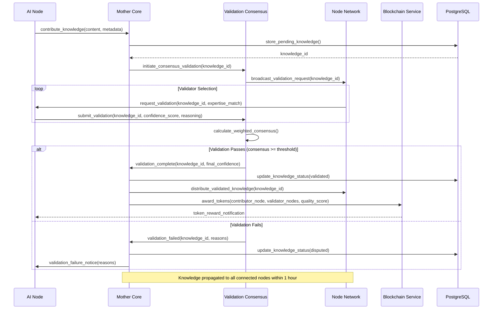
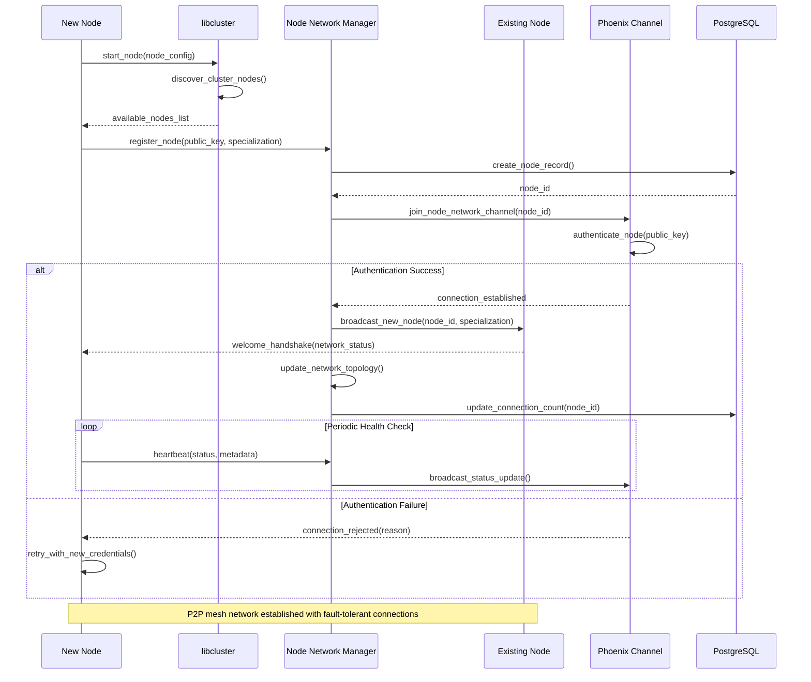
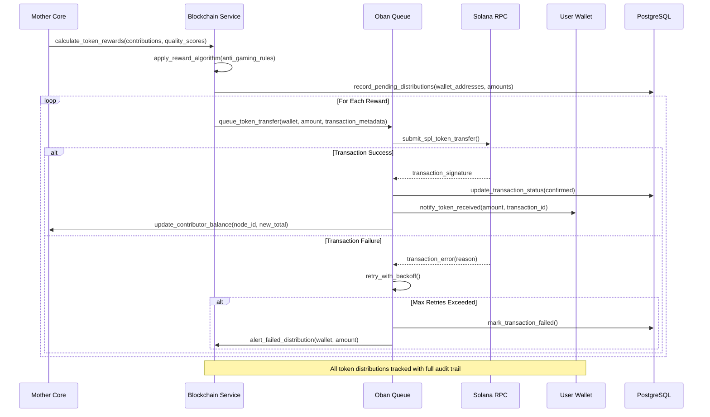
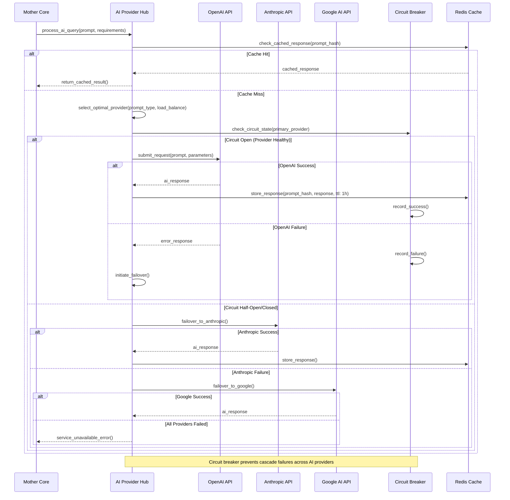

# Core Workflows

The following sequence diagrams illustrate key system workflows that demonstrate how xPando's components interact to achieve collective intelligence. These workflows show both the happy path and error handling scenarios critical for distributed AI operations.

## Knowledge Contribution and Validation Workflow

This workflow demonstrates how knowledge flows from individual nodes through the Mother Core validation process to network-wide distribution.



## Expert Node Discovery and Query Routing Workflow

This workflow shows how queries are intelligently routed to the most qualified expert nodes based on specialization and availability.

```mermaid
sequenceDiagram
    participant U as User/Client
    participant SE as Specialization Engine
    participant NN as Node Network
    participant EN as Expert Node
    participant AI as AI Provider Hub
    participant MC as Mother Core
    
    U->>SE: submit_query(question, domain_hint)
    SE->>SE: classify_query_domain(question)
    
    SE->>NN: find_domain_experts(domain, min_reputation)
    NN-->>SE: expert_nodes_list(sorted_by_expertise)
    
    loop Expert Selection
        SE->>EN: check_availability()
        alt Expert Available
            EN-->>SE: available(current_load)
            SE->>EN: route_query(question, context)
            break Expert Accepts Query
        else Expert Busy/Offline
            EN-->>SE: unavailable()
        end
    end
    
    EN->>AI: enhance_with_ai(question, specialization_context)
    AI-->>EN: ai_enhanced_response
    
    EN->>MC: contribute_enhanced_knowledge(response, confidence)
    MC->>MC: validate_and_score_response()
    
    EN->>U: deliver_expert_response(answer, confidence_score)
    MC->>BC: award_expertise_tokens(expert_node, query_complexity)
    
    Note over SE, EN: Expert reputation updated based on response quality
```

## Network Node Discovery and P2P Connection Workflow

This workflow illustrates how nodes discover each other and establish P2P connections in the distributed network.



## XPD Token Distribution Workflow

This workflow shows how the blockchain integration manages token rewards based on knowledge contribution quality.



## AI Provider Integration and Failover Workflow

This workflow demonstrates how the system handles AI provider integration with failover capabilities for high availability.


