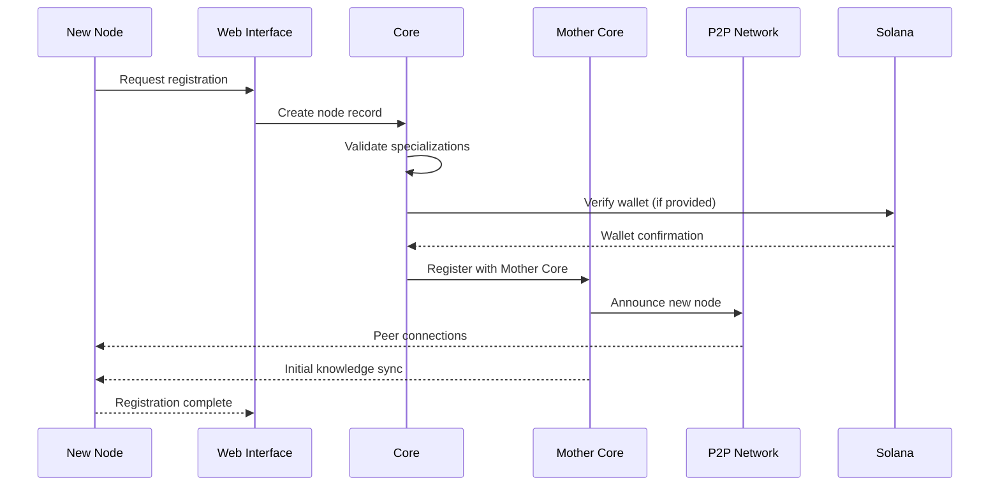
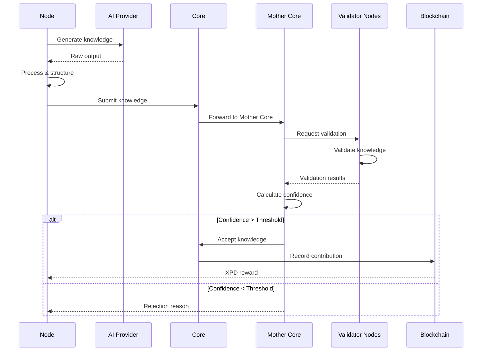
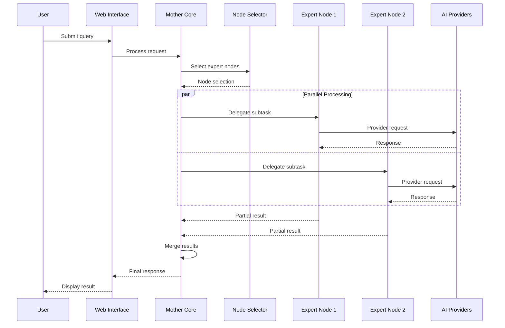

# Core Workflows

## Node Registration and Discovery

```mermaid
sequenceDiagram
    participant N as New Node
    participant W as Web Interface
    participant C as Core
    participant MC as Mother Core
    participant P2P as P2P Network
    participant S as Solana
    
    N->>W: Request registration
    W->>C: Create node record
    C->>C: Validate specializations
    C->>S: Verify wallet (if provided)
    S-->>C: Wallet confirmation
    C->>MC: Register with Mother Core
    MC->>P2P: Announce new node
    P2P-->>N: Peer connections
    MC-->>N: Initial knowledge sync
    N-->>W: Registration complete
```

## Knowledge Submission and Validation

```mermaid
sequenceDiagram
    participant N as Node
    participant AI as AI Provider
    participant C as Core
    participant MC as Mother Core
    participant V as Validator Nodes
    participant BC as Blockchain
    
    N->>AI: Generate knowledge
    AI-->>N: Raw output
    N->>N: Process & structure
    N->>C: Submit knowledge
    C->>MC: Forward to Mother Core
    MC->>V: Request validation
    V->>V: Validate knowledge
    V-->>MC: Validation results
    MC->>MC: Calculate confidence
    alt Confidence > Threshold
        MC->>C: Accept knowledge
        C->>BC: Record contribution
        BC-->>N: XPD reward
    else Confidence < Threshold
        MC-->>N: Rejection reason
    end
```

## Distributed Inference Request

```mermaid
sequenceDiagram
    participant U as User
    participant W as Web Interface
    participant MC as Mother Core
    participant NS as Node Selector
    participant N1 as Expert Node 1
    participant N2 as Expert Node 2
    participant AI as AI Providers
    
    U->>W: Submit query
    W->>MC: Process request
    MC->>NS: Select expert nodes
    NS-->>MC: Node selection
    
    par Parallel Processing
        MC->>N1: Delegate subtask
        N1->>AI: Provider request
        AI-->>N1: Response
    and
        MC->>N2: Delegate subtask
        N2->>AI: Provider request
        AI-->>N2: Response
    end
    
    N1-->>MC: Partial result
    N2-->>MC: Partial result
    MC->>MC: Merge results
    MC-->>W: Final response
    W-->>U: Display result
```