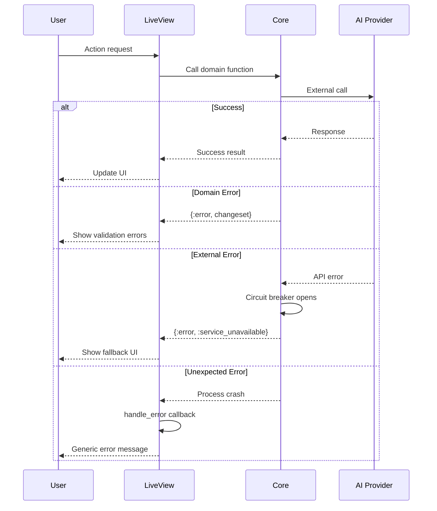

# Error Handling Strategy

## Error Flow


## Error Response Format
```elixir
# Standardized error structure
defmodule XPando.Error do
  defstruct [:code, :message, :details, :timestamp, :request_id]
  
  def format(error, request_id) do
    %__MODULE__{
      code: error_code(error),
      message: error_message(error),
      details: error_details(error),
      timestamp: DateTime.utc_now(),
      request_id: request_id
    }
  end
end
```

## Frontend Error Handling
```elixir
defmodule XPandoWeb.ErrorHelpers do
  use Phoenix.Component
  
  def error_banner(assigns) do
    ~H"""
    <div :if={@error} class="alert alert-error">
      <svg xmlns="http://www.w3.org/2000/svg" class="stroke-current shrink-0 h-6 w-6" fill="none" viewBox="0 0 24 24">
        <path stroke-linecap="round" stroke-linejoin="round" stroke-width="2" d="M10 14l2-2m0 0l2-2m-2 2l-2-2m2 2l2 2m7-2a9 9 0 11-18 0 9 9 0 0118 0z" />
      </svg>
      <span><%= error_message(@error) %></span>
    </div>
    """
  end
  
  defp error_message({:error, %Ash.Changeset{} = changeset}) do
    Ash.Changeset.errors(changeset)
    |> Enum.map_join(", ", & &1.message)
  end
  
  defp error_message({:error, message}) when is_binary(message), do: message
  defp error_message(_), do: "An unexpected error occurred"
end
```

## Backend Error Handling
```elixir
defmodule XPando.Core.ErrorHandler do
  require Logger
  
  def handle_error({:error, %Ash.Changeset{} = changeset}) do
    {:error, format_changeset_errors(changeset)}
  end
  
  def handle_error({:error, :timeout}) do
    Logger.warn("Operation timeout")
    {:error, %{code: "TIMEOUT", message: "Operation timed out"}}
  end
  
  def handle_error({:error, reason}) do
    Logger.error("Unexpected error: #{inspect(reason)}")
    Sentry.capture_exception(reason)
    {:error, %{code: "INTERNAL_ERROR", message: "Internal server error"}}
  end
  
  defp format_changeset_errors(changeset) do
    errors = Ash.Changeset.errors(changeset)
    %{
      code: "VALIDATION_ERROR",
      message: "Validation failed",
      details: Enum.map(errors, & %{field: &1.field, message: &1.message})
    }
  end
end
```