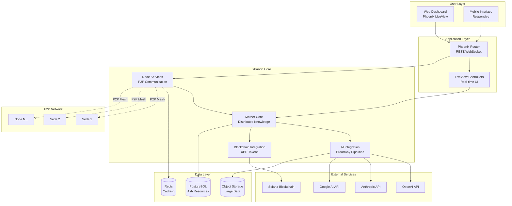

# High Level Architecture

## Technical Summary

xPando implements a distributed P2P collective intelligence platform using Elixir/OTP's actor model with Phoenix LiveView for real-time web interfaces. The architecture leverages a "Mixture of Experts" pattern where specialized AI nodes collaborate through a distributed Mother Core that aggregates and distributes knowledge using Ash Framework resources with PostgreSQL persistence. Broadway pipelines manage AI provider integrations (OpenAI, Anthropic, Google) while Solana blockchain integration enables XPD token economy. The platform deploys on Kubernetes with Fly.io for MVP, scaling to support 10,000+ concurrent nodes through BEAM VM's distributed computing capabilities and libcluster networking, achieving the PRD goal of 50% cost reduction and 10x performance improvement through collaborative intelligence.

## Platform and Infrastructure Choice

Based on PRD requirements for distributed AI collaboration and blockchain integration, I'm presenting three viable platform options:

**Option 1: Fly.io + Supabase + Solana Devnet (Recommended for MVP)**
- **Pros**: Elixir-native hosting, global edge deployment, built-in clustering, PostgreSQL managed service, rapid MVP deployment
- **Cons**: Limited enterprise features, potential scaling bottlenecks, newer platform with less mature ecosystem
- **Cost**: ~$200-500/month for MVP scale

**Option 2: AWS Full Stack (Enterprise Scale)**  
- **Pros**: Complete enterprise ecosystem, EKS for Kubernetes, RDS PostgreSQL, comprehensive monitoring, proven at scale
- **Cons**: Higher complexity, increased costs, over-engineered for MVP, requires more DevOps expertise
- **Cost**: ~$1000-2000/month for equivalent scale

**Option 3: Google Cloud Platform (AI/ML Optimized)**
- **Pros**: Superior AI/ML services, Vertex AI integration potential, strong Kubernetes support, cost-effective compute
- **Cons**: Less Elixir ecosystem support, learning curve, blockchain integration less mature
- **Cost**: ~$600-1200/month for equivalent scale

**Recommendation**: **Fly.io + Supabase + Solana Devnet** for MVP phase with AWS migration path for production scale. This choice optimizes for rapid development, Elixir ecosystem support, and cost efficiency while proving the distributed AI hypothesis.

**Platform:** Fly.io (MVP) with AWS migration path  
**Key Services:** Fly.io compute, Supabase PostgreSQL, Redis caching, S3-compatible storage, Solana RPC endpoints  
**Deployment Host and Regions:** Global edge deployment via Fly.io with primary regions in US-East, EU-West, Asia-Pacific

## Repository Structure

Given the distributed AI platform requirements and Elixir ecosystem, a **monorepo approach** is optimal for xPando:

**Rationale**: The tight integration between P2P networking, AI processing, web interface, and blockchain components benefits from shared code, unified testing, and coordinated deployment. Elixir umbrella applications naturally support this architecture while maintaining clear boundaries.

**Structure:** Elixir Umbrella Application with clear app boundaries  
**Monorepo Tool:** Native Elixir umbrella (no external tooling needed)  
**Package Organization:** Core domain logic, Web interface, Node networking, and Shared utilities as separate apps

## High Level Architecture Diagram

## Architectural Patterns

- **Event-Driven Architecture with Actor Model:** Leveraging OTP GenServers and supervision trees for fault-tolerant distributed processing - _Rationale:_ Natural fit for P2P networking and distributed AI workloads requiring resilience
- **CQRS with Ash Resources:** Command Query Responsibility Segregation through Ash actions separating reads/writes - _Rationale:_ Optimizes performance for complex knowledge queries while maintaining write consistency  
- **Mixture of Experts Pattern:** Specialized AI nodes collaborating on domain-specific tasks with intelligent routing - _Rationale:_ Core innovation enabling 10x performance improvement through collaborative intelligence
- **Saga Pattern for Distributed Transactions:** Managing cross-node knowledge sharing and token distributions - _Rationale:_ Ensures consistency in distributed operations without traditional ACID constraints
- **Publisher-Subscriber with Phoenix PubSub:** Real-time knowledge propagation and UI updates - _Rationale:_ Enables sub-second network updates and responsive user experience
- **Circuit Breaker Pattern:** Protecting against external API failures and node unavailability - _Rationale:_ Maintains system stability when AI providers or network nodes experience issues
