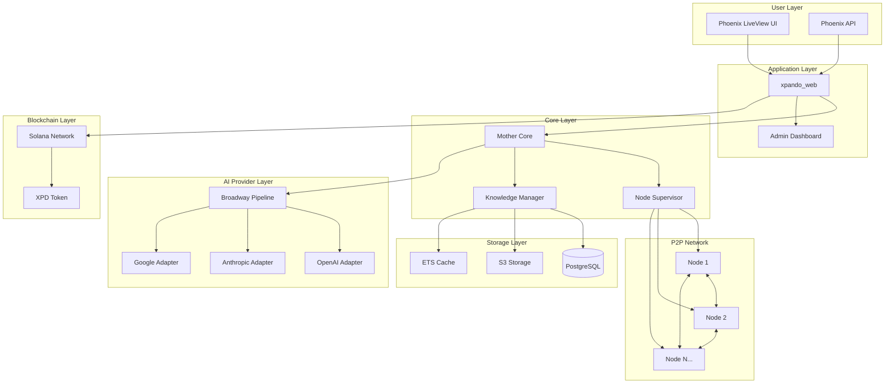

# High Level Architecture

## Technical Summary

xPando implements a distributed peer-to-peer AI collective intelligence platform using Elixir/OTP's actor model and Phoenix LiveView for real-time web interfaces. The architecture leverages BEAM's fault-tolerant distributed computing capabilities to enable AI nodes to share knowledge through a BitTorrent-inspired protocol, with a distributed Mother Core aggregating learnings. The system integrates with multiple AI providers through Broadway pipelines and implements a Solana blockchain-based XPD token economy for incentivizing contributions. This architecture achieves the PRD goals of 50% cost reduction and 10x performance improvement through collaborative intelligence while maintaining sub-500ms inference latency.

## Platform and Infrastructure Choice

**Platform:** Hybrid Cloud (Fly.io MVP → AWS Production)
**Key Services:** Fly.io (initial deployment), AWS EKS (production Kubernetes), S3 (knowledge storage), PostgreSQL (managed), Solana RPC nodes
**Deployment Host and Regions:** Multi-region deployment (US-East, US-West, EU-West) for global node distribution

## Repository Structure

**Structure:** Elixir Umbrella Application (Monorepo)
**Monorepo Tool:** Mix Umbrella (native Elixir)
**Package Organization:** Core domain (xpando_core), Web interface (xpando_web), Node runtime (xpando_node), Blockchain integration (xpando_blockchain)

## High Level Architecture Diagram

## Architectural Patterns

- **Actor Model (OTP/GenServer):** Each AI node runs as a supervised GenServer process enabling fault tolerance and message-passing concurrency - _Rationale:_ BEAM's actor model provides built-in distribution and fault recovery essential for P2P networks
- **Event-Driven Architecture:** Broadway pipelines process AI requests and knowledge updates asynchronously - _Rationale:_ Handles varying AI provider latencies and enables backpressure control
- **CQRS with Event Sourcing:** Separate read/write paths for knowledge with event log persistence - _Rationale:_ Enables knowledge history tracking and Byzantine fault tolerance
- **Hexagonal Architecture:** Core domain isolated from external dependencies via ports and adapters - _Rationale:_ Allows swapping AI providers and storage backends without core logic changes
- **Phoenix LiveView Real-time UI:** Server-rendered reactive UI without JavaScript complexity - _Rationale:_ Reduces frontend complexity while maintaining real-time updates
- **Repository Pattern:** Ash Resources abstract all data access - _Rationale:_ Consistent data layer with built-in authorization and validation
- **Circuit Breaker Pattern:** Protect against cascading failures in distributed node network - _Rationale:_ Essential for maintaining system stability with thousands of nodes
- **Mixture of Experts Architecture:** Specialized AI nodes collaborate on complex tasks - _Rationale:_ Core innovation enabling 10x performance improvement on specialized tasks